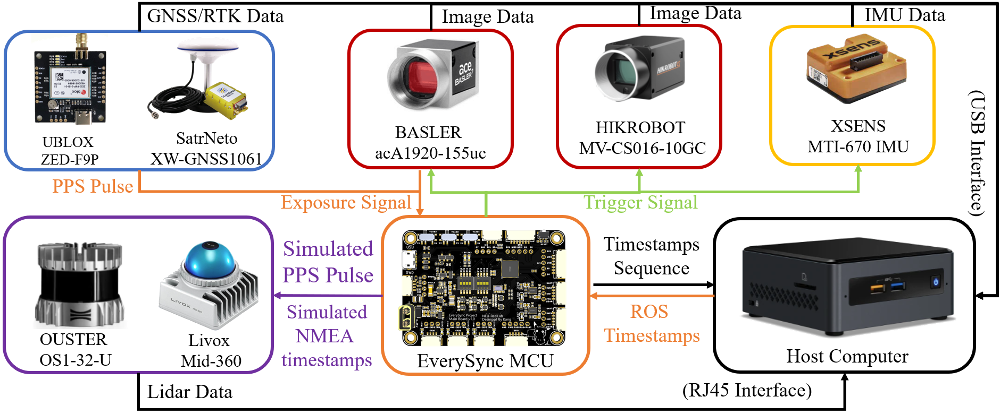

# EverySync -- Master In Host PC
**EverySync** is An Open Hardware Time Syncronization Sensor Suite For Every Casual Sensor In Field Of SLAM.
- Our project provides a complete, open-source hardware, firmware and software bundle to perform `hardware time synchronization ` of multiple sensors in SLAM system.



Entry of This Project:

* [EverySync -- Master In Host PC](https://github.com/TheConquerK/every_sync_master) ROS master program on PC

* [EverySync -- Firmware on Board](https://github.com/TheConquerK/every_sync_firmware) EverySync Board package for arduino IDE

* [EverySync -- HardwareSuite](https://github.com/TheConquerK/EverySync_HardwareSuite) Open source Hardware Suite of EverySync.


## News
- **May 26, 2022** Finish first version named RealVIS v1.0 .
- **May  8, 2023** Support at least 3 kinds of Lidar.

## Supported drivers
### Camera 
* [Basler](https://github.com/TheConquerK/every_sync_master/tree/master/src/driver/pylon-ros-camera) tested with acA1920-155uc
* [HikVision](https://github.com/TheConquerK/every_sync_master/tree/master/src/driver/HIKROBOT-MVS-CAMERA-ROS) tested with HikVision MV-CA023-10UC
#### Camera Support From VersaVIS
* [MatrixVision](https://github.com/ethz-asl/bluefox2/tree/devel/versavis) tested with Bluefox 2 MLC200WG, needs adaption for new format
* [PointGrey/Flir](https://github.com/ethz-asl/flir_camera_driver/tree/devel/versavis) tested with Chameleon 3, Blackfly S
* [CamBoard](https://github.com/ethz-asl/pico_flexx_driver/tree/devel/versavis) tested with CamBoard pico monstar

### TriggeralbeIMU
* [Xsens](https://github.com/TheConquerK/every_sync_master/tree/master/src/driver/xsens_ros) Support Xsens MTi-100 Series & Xsens MTi-600 Series.Tested with Xsens MTi-300,MTi-630,MTi-670-DK.
### IMU Support From VersaVIS
* [ADIS](https://github.com/TheConquerK/every_sync_master/tree/master/src/versavis/versavis/src) Originally Support ADIS16448 from VersaVIS

### Lidar
* [Ouster](https://github.com/TheConquerK/every_sync_master/tree/master/src/driver/pylon-ros-camera) tested with Ouster-OS1-32
* [Robosense](https://github.com/TheConquerK/every_sync_master/tree/master/src/driver/HIKROBOT-MVS-CAMERA-ROS) tested with Robosense16
* [Livox](https://github.com/TheConquerK/every_sync_master/tree/master/src/driver/HIKROBOT-MVS-CAMERA-ROS) tested with Livox Mid-40 , Mid-70 , Mid-360

### GNSS/GPS
* [Ublox](https://github.com/HKUST-Aerial-Robotics/ublox_driver) tested with Ublox ZED-F9P

## Citing

- To Be Released.

## Install

### Clone and build
```
cd catkin_ws/src
git clone https://github.com/TheConquerK/every_sync_master.git
catkin_make
```

```
cd versavis/firmware
./setup.sh
```

### Setup udev rule
Add yourself to `dialout` group
```
sudo adduser <username> dialout
```

Copy udev rule file to your system:
```
sudo cp firmware/98-versa-vis.rules /etc/udev/rules.d/98-versa-vis.rules
```
Afterwards, use the following commands to reload the rules
```
sudo udevadm control --reload-rules
sudo udevadm trigger
sudo ldconfig
```
Note: You might have to reboot your computer for this to take effect. You can check by see whether a `/dev/versavis` is available and pointing to the correct device.

### Configure
Adapt the [configuration file](https://github.com/ethz-asl/versavis/blob/master/firmware/libraries/versavis/src/versavis_configuration.h) to your setup needs. Also check the [datasheet](https://drive.google.com/file/d/11QCjc5PVuMU9bAr8Kjvqz2pqVIhoMbHA/view?ts=5dc98776) for how to configure the hardware switches.

### Flash firmware on the VersaVIS board
* Install the arduino IDE from [here](https://www.arduino.cc/en/Main/OldSoftwareReleases#previous). Use version 1.8.2!
    - Note that a small modification of the install script (`install.sh`) might be required. In particular you may need to change the line `RESOURCE_NAME=cc.arduino.arduinoide` to `RESOURCE_NAME=arduino-arduinoide` as per the issue [here](https://github.com/arduino/Arduino/issues/6116#issuecomment-290012812).
* Open `firmware/versavis/versavis.ino` in the IDE
* Go to `File -> Preferences`
* Change Sketchbook location to `versavis/firmware/`
* Install board support:
    - For AVI 2.1 (the green one): Tools -> Boards -> Boards Manager -> Arduino SAMD Boards (32-bits ARM Cortex-M0+) -> Use version 1.6.20!
    - For VersaVIS 1.0 (the black one): [Check here](https://github.com/ethz-asl/versavis_hw/)
* Set `Tools -> Port -> tty/ACM0 (Arduino Zero)`, and `Tools -> Board -> VersaVIS`.
* Compile using the *Verify* menu option
* Flash using the *Upload* menu option


## Usage
* Adapt `everysync/launch/pps_test.launch` to your needs.
* Run with
```
roslaunch everysync pps_test.launch
```
* Wait for successfull initialization.
* Or initialization by publish rostopic.
```
./init_cam.sh
```


## Acknowledgements
**There are several important works which support this project:**
- [VersaVIS](https://github.com/ethz-asl/versavis): An Open Versatile Multi-Camera Visual-Inertial Sensor Suite
- [Versavis-Hw](https://github.com/ethz-asl/versavis_hw): VersaVIS Board package for arduino IDE.


## Licence
The source code is released under [GPLv3](https://www.gnu.org/licenses/) license.

## Maintenance
We are still working on extending the proposed system and improving code reliability.

For any technical issues, please contact Xuankang Wu (1035309950@qq.com) .

<!-- For commercial inquiries, please contact Fei Gao (fgaoaa@zju.edu.cn). -->
